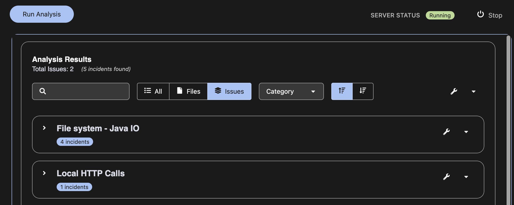
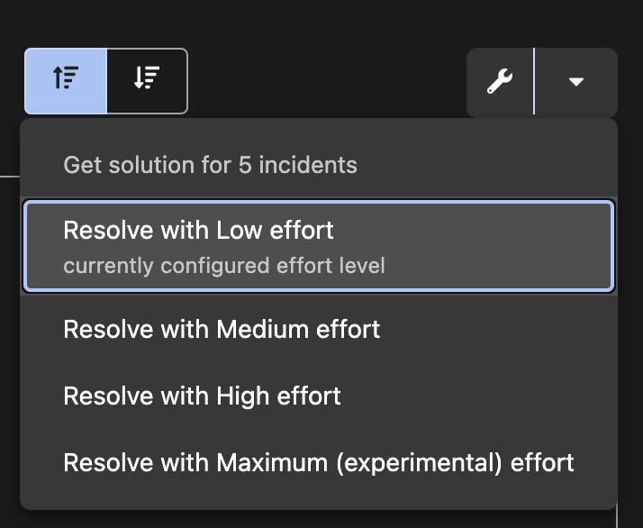
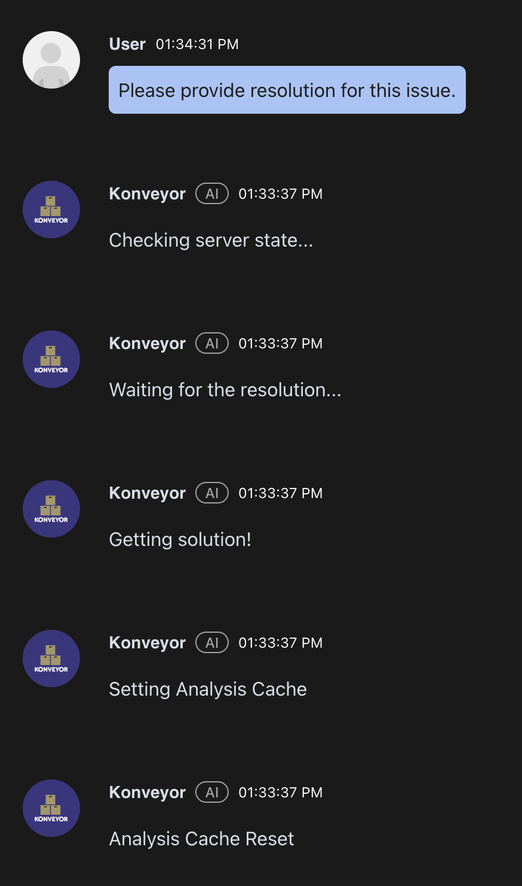
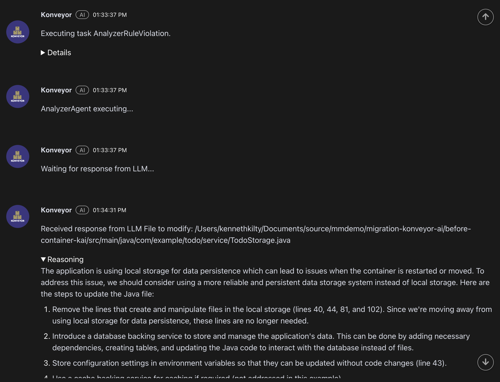
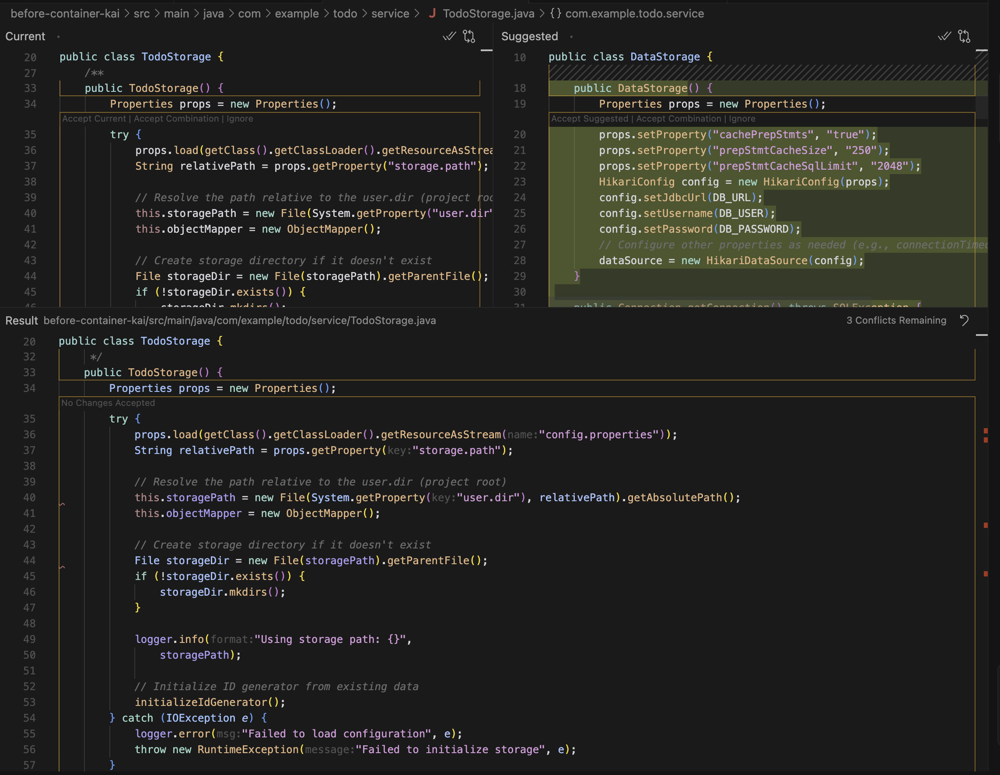
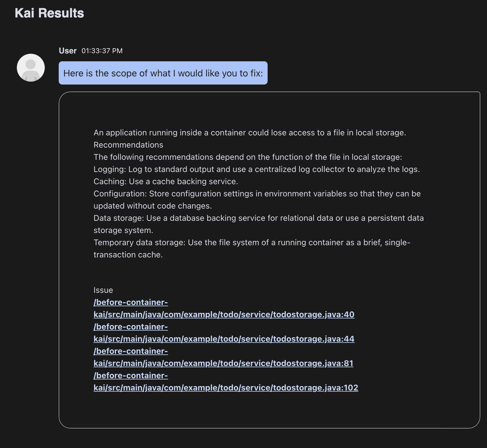

# Konveyor AI Analysis Journey

This repository documents our journey using Konveyor AI (KAI) to analyze and modernize Java applications, demonstrating how a hybrid approach combining KAI's automated improvements with necessary human oversight provides a practical path to successful application modernization. We'll record each step of our experience, from setup to implementation. Please note that this is based on very early work with KAI, a tool undergoing frequent updates and active development on a weekly basis. Take this analysis for what it is—a deep dive into using KAI to remediate our sample Java to-do application and a comparison of what KAI fixed and how it performed versus our use of Claude in addressing the after-container version of the same app.

## Project Structure

- `before-container-kai/` - Copy of the original Java Todo application for Konveyor AI analysis
  - `src/` - Application source code
  - `pom.xml` - Project dependencies
- `content/` - Supporting documentation and artifacts

## Our Journey

### Step 1: Installation of KAI and Dependencies

1. Install Prerequisites:
   - Java 17 or later
   - Latest version of Maven
   - [Ollama](https://ollama.com/) for local LLM support
     ```bash
     ollama pull mistral
     ```

2. Install Konveyor AI Extension:
   - Download the latest `.vsix` file (v0.1.0) from [editor-extensions/releases](https://github.com/konveyor/editor-extensions/releases)
   - In VS Code:
     - Press `Ctrl+Shift+X` (Windows/Linux) or `Cmd+Shift+X` (macOS)
     - Click `...` (More Actions)
     - Select "Install from VSIX..."


### Step 2: LLM Configuration

Configure Konveyor AI to use local Ollama instance w/Mistral:

```yaml
# provider-settings.yaml
ChatOllama: &active
  provider: "ChatOllama"
  args:
    model: mistral
```

### Step 3: Starting the KAI Analysis Server

1. Open the Konveyor Analysis View in VS Code
2. The server status should show "Running" in the top right
   

3. Verify Konveyor Logs:
   - Check `.vscode/konveyor-logs/` for:
     - `kai-analyzer-server.log`
     - `kai-rpc-server.log`
   
   Example of successful server startup:
   ```log
   # From successful-startup.log
   INFO - kai - MainThread - init_logging() - We have inited the logger: file_logging: DEBUG console_logging: DEBUG
   INFO - kai.kai-rpc-logger - MainThread - main() - Started kai RPC Server
   INFO - kai.kai.cache - Thread-1 - Using cache dir: /tmp/kai/llm_cache
   # Server is now running and ready to process analysis requests
   ```

### Step 4: KAI Configuration

Similar to our Kantra CLI setup, configure KAI with cloud-readiness target and custom rules by creating/updating `.vscode/settings.json`:

```json
{
    "konveyor.analysis.labelSelector": "(konveyor.io/target=cloud-readiness) || (discovery)",
    "konveyor.analysis.customRules": [
        "/path/to/your/rulesets/legacy-practices.yaml"
    ],
    "konveyor.analysis.useDefaultRulesets": true
}
```

This configuration:
- Sets the analysis target to cloud-readiness
- Includes custom rules from your legacy-practices.yaml (from the migration-konveyor folder)
- Enables default rulesets for comprehensive analysis

### Step 5: Running the Analysis

1. With the server running (indicated by "Running" status in the top right), click the "Run Analysis" button in the KAI extension.

2. The analysis results will appear in the KAI view, showing the same violations we previously identified using Kantra CLI:
   

   The results show:
   - Total Issues: 2 (5 incidents found)
   - File system - Java IO: 4 incidents
   - Local HTTP Calls: 1 incident

   These findings align to the previous Kantra analysis, but are presented in a more interactive, graphical interface. Additionally, KAI provides GenAI-powered remediation options using our configured LLM (Mistral in this case). For each issue, we can choose from four effort levels:

   

   - **Resolve with Low effort**: Attempts to fix only the detected issues with minimal changes. The code planner focuses on direct symbol replacements and straightforward modifications without exploring deeper architectural changes.
   
   - **Resolve with Medium effort**: Takes a more comprehensive approach by fixing the detected issues and resolving any new issues that arise from the initial fixes. This includes handling dependency updates and ensuring symbol resolution across the codebase.
   
   - **Resolve with High effort**: Implements an iterative resolution process that continues until no further problems remain. This may involve multiple passes of analysis and fixes, potentially suggesting architectural improvements and modernization patterns.
   
   - **Resolve with Maximum (experimental) effort**: The most thorough level of remediation, potentially involving complete component rewrites and major architectural changes to align with modern best practices.

   > Note: This understanding of effort levels is inferred from reviewing the KAI codebase, particularly the code planner and agentic workflow implementation. As the project is in active development, the actual behavior may vary.

   ### How KAI's Code Fix Engine Appears to Work

   From our analysis of the KAI codebase, the code fix engine appears to implement an "Agentic Workflow" that coordinates multiple specialized agents to resolve migration issues. The workflow typically involves:

   1. An **AnalyzerAgent** that identifies issues and generates initial LLM-based solutions
   2. A **MavenCompilerAgent** that handles non-dependency compilation errors
   3. A **MavenDependencyAgent** that manages dependency-related issues
   4. A **ReflectionAgent** that validates changes and triggers additional analysis if needed

   The engine uses a feedback loop where each fix is validated through reanalysis of the codebase, potentially generating new tasks if additional issues are discovered. The depth and breadth of this process are controlled by the selected effort level above.

   > Note: This description is based on a cursory review of the KAI codebase and may not fully reflect the current implementation or official documentation.

### Step 6: Remediating Issues with KAI-Generated Code Fixes

When using KAI's "Resolve with Low effort" option, the process follows a non-interactive workflow:

1. KAI initiates the remediation process by:
   - Checking server state
   - Analyzing the issue scope
   - Setting up the analysis cache
   - Executing the AnalyzerRuleViolation task
   
   

2. The system then:
   - Activates the AnalyzerAgent
   - Queries the LLM for appropriate code fixes
   - Provides a detailed reasoning for the proposed changes
   
   

3. For our file system usage issue, KAI provided the following analysis and remediation plan:
   ```
   The application is using local storage for data persistence which can lead to issues 
   when the container is restarted or moved. To address this issue, we should consider 
   using a more reliable and persistent data storage system instead of local storage. 
   ```

4. The remediation preview shows inline diffs of proposed changes:
   - Removing local file system operations (lines 40, 44, 81, and 102)
   - Introducing database connectivity with HikariCP
   - Converting file-based storage to database operations
   - Moving configuration to environment variables
   
   

5. The preview includes both the current implementation and suggested changes side-by-side:
   - Left side: Current `TodoStorage` class using file-based storage
   - Right side: Proposed `DataStorage` class using HikariCP and database connectivity
   - Highlighted sections showing specific code modifications

6. Summary of KAI's generated code implementation
   - a HikariCP-managed database connection pool. Specifically, it:
   - Removed all File I/O operations from TodoStorage.java
   - Created a new DataStorage class with database connectivity
   - Added HikariCP configuration for connection pooling
   - Implemented CRUD operations using SQL instead of file operations
   - Added environment variable support for database configuration

   The generated code non-unexpectedly required significant manual adjustments to handle proper 
   error cases, add missing CRUD implementations, and fix build configuration issues.
   

> Note: At this stage, the process is minimally interactive. KAI presents the changes as a complete solution rather than step-by-step modifications. Review the proposed changes carefully before applying them.

### Step 7: Deep Diving KAI Code Generation (Fixes)

After applying KAI's suggested fixes, there were some issues. The main problems centered around missing dependencies and build configuration.

#### Build Configuration Issues

The original pom.xml had several critical issues:
1. Malformed XML structure
2. Missing required Maven project elements
3. Incomplete dependency declarations
4. Documentation comments mixed with actual configuration

We resolved these by implementing a complete `pom.xml` ironically through AI assisted code chat. We implemented the following fixes:

1. **Database Implementation**:
   ```java
   public class DataStorage {
       private static final Logger logger = LoggerFactory.getLogger(DataStorage.class);
       private static final String DB_URL = System.getenv().getOrDefault(
           "DB_URL", "jdbc:h2:mem:tododb;DB_CLOSE_DELAY=-1");
       private static HikariDataSource dataSource;

       public DataStorage() {
           initializeDataSource();
           createTodoTable();
       }
       // ... implementation of CRUD operations
   }
   ```

2. **Connection Pool Configuration**:
   ```java
   private void initializeDataSource() {
       Properties props = new Properties();
       props.setProperty("cachePrepStmts", "true");
       props.setProperty("prepStmtCacheSize", "250");
       props.setProperty("prepStmtCacheSqlLimit", "2048");
       
       HikariConfig config = new HikariConfig(props);
       config.setJdbcUrl(DB_URL);
       config.setMaximumPoolSize(10);
       config.setMinimumIdle(5);
       config.setIdleTimeout(300000);
       config.setConnectionTimeout(20000);
       
       dataSource = new HikariDataSource(config);
   }
   ```

3. **Database Schema Management**:
   ```java
   private void createTodoTable() {
       String sql = "CREATE TABLE IF NOT EXISTS todos ("
           + "id BIGINT PRIMARY KEY AUTO_INCREMENT,"
           + "title VARCHAR(255) NOT NULL,"
           + "description TEXT,"
           + "completed BOOLEAN DEFAULT FALSE,"
           + "created_at TIMESTAMP DEFAULT CURRENT_TIMESTAMP,"
           + "completed_at TIMESTAMP"
           + ")";
       // ... table creation logic
   }
   ```

4. **CRUD Operations Implementation**:
   - `loadTodos()`: Retrieves all todos with proper ordering
   - `addTodo()`: Handles ID generation and timestamps
   - `updateTodo()`: Manages completed status and timestamps
   - `deleteTodo()`: Ensures proper cleanup

5. **Error Handling and Logging**:
   - Comprehensive exception handling for SQL operations
   - Detailed logging for debugging and monitoring
   - Proper resource cleanup with try-with-resources

6. **Package Structure Cleanup**:
   - Removed old `TodoStorage.java`
   - Created proper package structure
   - Updated all references in `TodoServlet.java`

#### Errata

This document was created during early experimentation with KAI (January-February 2024). As KAI is under active development:

1. **Version Information**:
   - KAI Extension: v0.1.0
   - Ollama: Latest as of February 2024
   - Mistral Model: 7.2B parameter version as of as of February 2024

2. **Image References**:
   - All screenshots are from KAI v0.1.0
   - UI elements may have changed in newer versions
   - Workflow steps may have been updated

Please refer to the [official KAI documentation](https://github.com/konveyor/kai/tree/main/docs) and the [Konveyor blog](https://www.konveyor.io/blog/) for the most up-to-date information.

